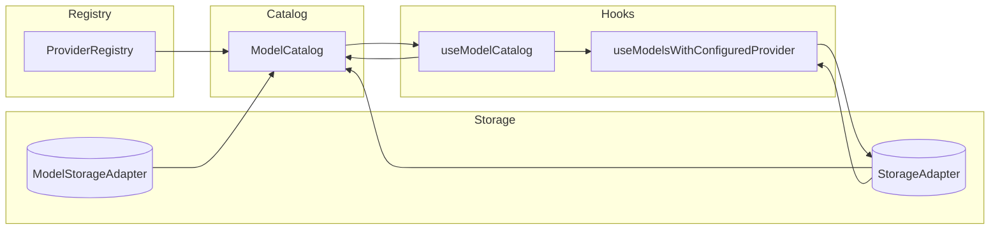
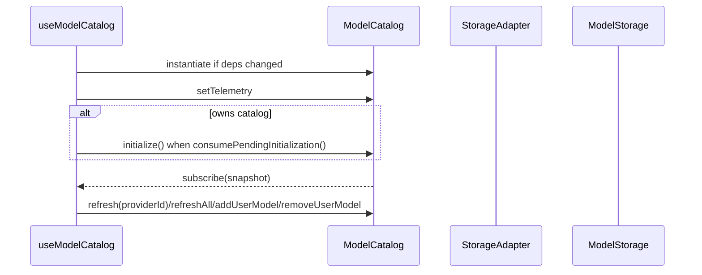
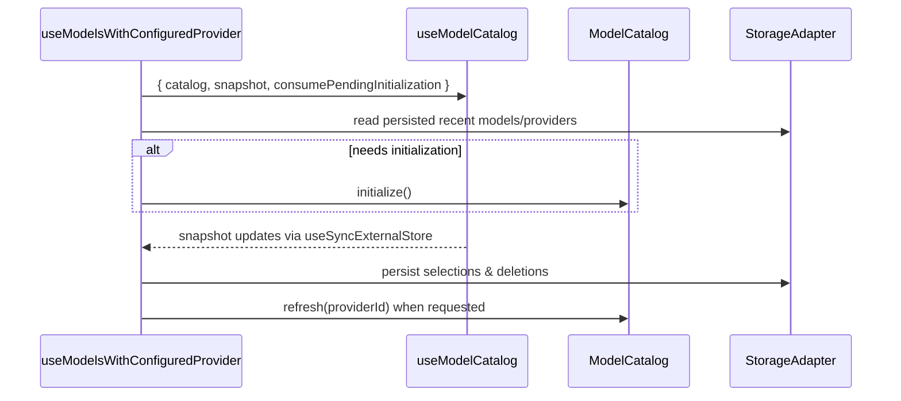
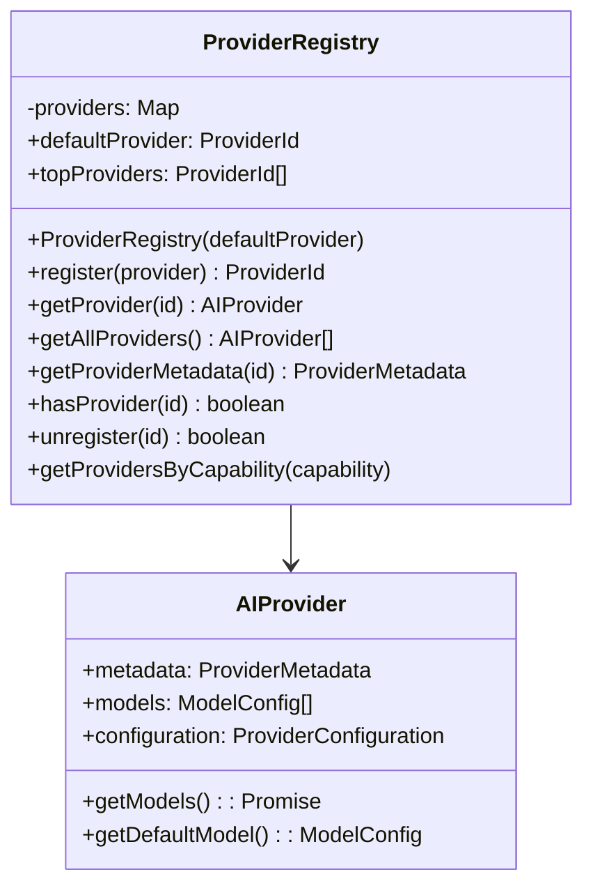
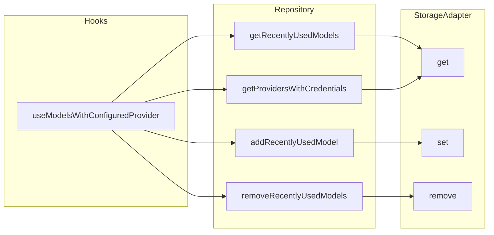

# Model Picker Architecture

This document explains how the model picker keeps provider catalogs, storage, and React state in sync. It starts with a high-level tour and then dives into the key building blocks: hooks, the catalog, the provider registry, and supporting utilities.

## High-Level Overview

At runtime the picker orchestrates three primary concerns:

- **Provider definitions** live in the `ProviderRegistry`, which exposes metadata and provider APIs.
- **Model availability** is normalized by the `ModelCatalog`, which hydrates from storage, fetches remote models, and emits snapshots composed of branded keys.
- **UI state** flows through the unified `useModelCatalog` hook (and downstream helpers such as `useModelsWithConfiguredProvider`) that bind storage, catalog snapshots, and user selections together.



The diagram highlights the circular relationship: `useModelCatalog` subscribes to catalog snapshots, exposes mutations, and downstream hooks/components consume those snapshots while persisting user intent back to storage.

## Hook Architecture

### `useModelCatalog`

`src/lib/hooks/useModelCatalog.ts`

Responsibilities:

- Create or reuse a `ModelCatalog` with consistent branded storage and telemetry wiring.
- Hydrate persisted data when the hook owns the catalog lifecycle via `consumePendingInitialization()`.
- Expose the live snapshot (including branded `ProviderAndModelKey` values) through `useSyncExternalStore` subscription.
- Provide catalog mutations (`refresh`, `refreshAll`, `addUserModel`, `removeUserModel`) that downstream hooks/components can call.



### `useModelsWithConfiguredProvider`

`src/lib/hooks/useModelsWithConfiguredProvider.ts`

This hook now composes the unified catalog hook to drive UI state:

- Calls `useModelCatalog` to obtain the catalog instance, live snapshot, and lifecycle token.
- Hydrates recently used models and providers with credentials from storage whenever `consumePendingInitialization()` reports a fresh catalog.
- Persists selection updates (`addRecentlyUsedModel`, `addProviderWithCredentials`) and handles deletions.
- Derives available models using `deriveAvailableModels`, ensuring consistent filtering/sorting across the hook while reusing branded keys from the snapshot.



## Model Catalog

`src/lib/catalog/ModelCatalog.ts`

The catalog is the single source of truth for model availability. It keeps normalized model maps per provider and exposes reactive snapshots.

### Lifecycle

- **Construction** seeds built-in provider models (`seedBuiltin`) so UI has data immediately.
- **Initialization (`initialize`)** hydrates persisted models and optionally prefetches remote data for providers that have stored credentials.
- **Refresh** evaluates provider configuration, marks status, fetches models, merges API results, and persists non-builtin entries.
- **Listeners**: `subscribe` returns an unsubscribe closure while `getSnapshot` reuses a cached snapshot, recomputing when provider membership changes.

```mermaid
flowchart LR
  subgraph Seeds
    A[seedBuiltin]
  end
  subgraph Hydration
    B[ensureProviderState]
    C[ensurePersistedLoaded]
  end
  subgraph Network
    D[refresh(providerId)]
    E[mergeApi]
  end
  subgraph Persistence
    F[persistNonBuiltin]
  end
  subgraph Emission
    G[recomputeSnapshot]
    H[emit]
  end

  A --> B
  B --> C
  C --> G
  D --> E --> F
  D --> G
  G --> H
```

### Snapshot Structure

Each snapshot entry is a `ProviderModelsStatus` containing:

- `models`: Array of `CatalogEntry` values (each includes the branded `ProviderAndModelKey`).
- `status`: one of the typed `ProviderStatus` variants (`'idle' | 'loading' | 'refreshing' | 'ready' | 'missing-config' | 'error'`).
- Optional `error` message when in error state.

The catalog keeps additional internal sets:

- `hydratedProviders` to avoid rehydrating persisted data repeatedly.
- `pendingHydrations` to dedupe concurrent initialization work per provider.
- `pendingRefreshes` to guard against overlapping refresh sequences.

## Provider Registry

`src/lib/providers/ProviderRegistry.ts`

The registry is the catalog’s view of the provider universe. It is intentionally thin, delegating almost everything to provider instances.



Key points:

- `topProviders` is a curated ordering used by UI components for prominence.
- `register` guards against duplicate IDs; `getProvider` throws when a provider is missing, surfacing misconfiguration early.
- Capability lookups (`getProvidersByCapability`) are convenience APIs for UI filters.

## Supporting Utilities & Topics of Interest

### Storage Repositories

`src/lib/storage/repository.ts` and `src/lib/storage/modelRepository.ts` abstract persistence. Hooks call these helpers rather than dealing with keys directly, which keeps storage swappable. Telemetry hooks can observe read/write errors.



### Catalog Utilities

`src/lib/hooks/catalogUtils.ts` now centralizes list derivation logic:

- `flattenAndSortAvailableModels` normalizes per-provider snapshots into a sorted list honoring visibility, discovery timestamps, and stable alphabetical ordering.
- `deriveAvailableModels` wraps the flattening step with deduplication (`providerAndModelKey`), ensuring the deletion flow, initialization, and memoized list share identical filtering rules.

### Telemetry Touchpoints

Telemetry callbacks from `ModelPickerTelemetry` are invoked during catalog operations:

- `onFetchStart`, `onFetchSuccess`, `onFetchError` during refresh cycles.
- `onUserModelAdded` when the user creates local entries.
- Storage operations can surface errors through `onStorageError`.

These hooks make it easy to surface progress indicators, analytics events, or logging without coupling the catalog to any specific telemetry client.

### React Integration Patterns

The hooks follow a consistent pattern:

1. **Reference stability first**: internal state like catalog ownership is tracked in refs, avoiding dependency churn.
2. **useSyncExternalStore**: ensures React’s concurrent rendering semantics are respected for catalog subscriptions.
3. **Pure derivation helpers** (`deriveAvailableModels`) keep memoized selectors deterministic and easy to test (see `tests/hooks.catalogUtils.test.ts`).

Together these patterns make the model picker resilient to provider churn, network variability, and UI-driven storage operations.
